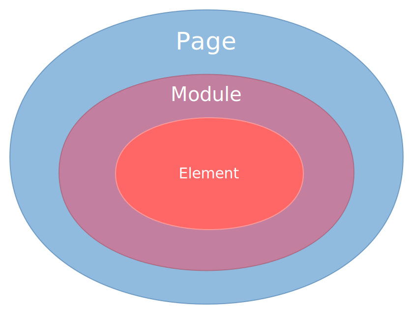

# 工作台运行配置 workbench

## 说明

workbench中存放的数据是工作台配置，工作台的界面渲染、值的校验等等都依赖于这部分的信息。<br>
工作台最终修改的值会保存在dist中。

## 层级关系

分为三个层级，最终每个元素都会包裹在页面、模块中：<br>
page > module > element<br>


## 示例

```json
{
    "workbench": {
        "elements": {...},
        "modules": {...},
        "pages": {...}
    }
}
```
