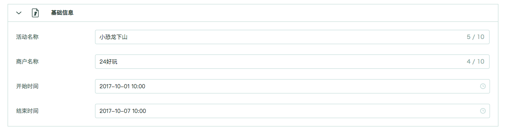

# 预设模块

## 定义

预设模块是由平台提供的，对应指定平台功能的模块（例如：`防刷奖保护`）。平台提供了众多预设模块来满足模板的服务、营销需求。

我们将这些预设模块分为[服务模块](./service.md)、[营销模块](./market.md)两部分。

## 如何使用

只需要引用指定模块的ID，即可引入整个模块。

## 示例：

根据上述说明，假定我们想要引入平台`基本信息`这一模块，则有以下配置示例：

```json
{
    "workbench": {
        "pages": [
            {
                "modules": [
                    "serviceBase"
                ],
                "name": "基本配置",
                "id": "base"
            }
        ]
    }
}
```

上述示例中可以看到，在`基本配置`页的配置里面，我们只在modules里添加了一个字符串`serviceBase`，而最终渲染结果是：



