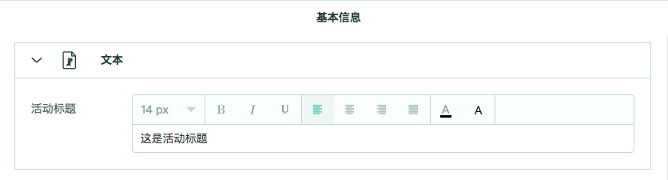

# 来写一份配置表

## 开始之前

配置表的层级结构非常简单：页面 > 模块 > 元素。

比如你的模板有一个标题是可被配置的，那么这个标题就可以是一个类型为单行文本的元素。

这个元素可以被放在一个叫“文本”的模块中，这个模块又可以被放在一个叫“基本信息”的页面中。

下面我们来写这个配置表。

## 第一步：编写工作台配置（用于渲染界面）

按照上面的假设，我们需要一个名为“基本信息”的页面：

```json
{
    "workbench": {
        "pages": [
            {
                "id": "basic",
                "name": "基本信息"
            }
        ]
    }
}
```

接下来，添加一个名为“文本”的模块：

```json
{
    "workbench": {
        "pages": [
            {
                "id": "basic",
                "name": "基本信息",
                "modules": [
                    {
                        "id": "text",
                        "name": "文本"
                    }
                ]
            }
        ]
    }
}
```

最后我们来添加一个类型为单行文本输入框的元素：

```json
{
    "workbench": {
        "pages": [
            {
                "id": "basic",
                "name": "基本信息",
                "modules": [
                    {
                        "id": "text",
                        "name": "文本",
                        "elements": [
                            {
                                "id": "title",
                                "name": "活动标题",
                                "type": "input"
                            }
                        ]
                    }
                ]
            }
        ]
    }
}
```

至此，工作台的配置已编写完毕，以上信息表明了我们有一个页面，页面中有一个模块，模块中又有一个单行文本输入框。

## 第二步：编写运行配置（用于支持真正的活动运行）

工作台产出的值都会在dist对象里面，每一个元素对应一个值，例如上述单行文本输入框这个元素，对应的产出值就是一个字符串。

那么，这个元素需要一个默认值，于是我们来编写运行配置。

```json
{
    "dist": {
        "title": {
            "value": "这是活动标题"
        }
    }
}
```

没错，就这么简单。每当用户使用该工作台更改活动的配置后，dist中对应的值就会发生变化。

## 渲染效果



## 示例

```json
{
    "dist": {
        "title": {
            "value": "这是活动标题"
        }
    },
    "workbench": {
        "pages": [
            {
                "id": "basic",
                "name": "基本信息",
                "modules": [
                    {
                        "id": "text",
                        "name": "文本",
                        "elements": [
                            {
                                "id": "title",
                                "name": "活动标题",
                                "type": "input"
                            }
                        ]
                    }
                ]
            }
        ]
    }
}
```

示例非常简单，但远远没有能满足我们配置一个活动的需求，接下来就是按照这种规则来丰富你的配置表了，详细请参阅下文。
