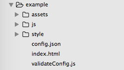

# 部署你的代码

#### 目录结构

在项目根目录下能找到example文件夹：

展开example文件夹，能看到如下内容：

对example下的文件要求如下：

文件名称 | 说明 | 是否必须 | 文件名是否指定
:-----  | :-- | :-----  | :-------
index.html | 模板页面文件 | 是 | 是
config.json | 模板配置文件 | 是 | 是
validateConfig.js | 模板自定义校验脚本 | 否 | 是
assets  | 模板资源目录 | 否 | 否
js    | 模板脚本目录  | 否 | 否
style | 模板样式目录 | 否  | 否

#### 补充说明

1. 就最简单的项目而言，只有`index.html`和`config.json`是必须的，其他文件和目录可自由组织。
2. `validateConfig.js`只有在需要自定义校验脚本的时候才需要用到，用法在配置表文档将会提到。
3. `config.json`如何编写，请参考配置表文档。