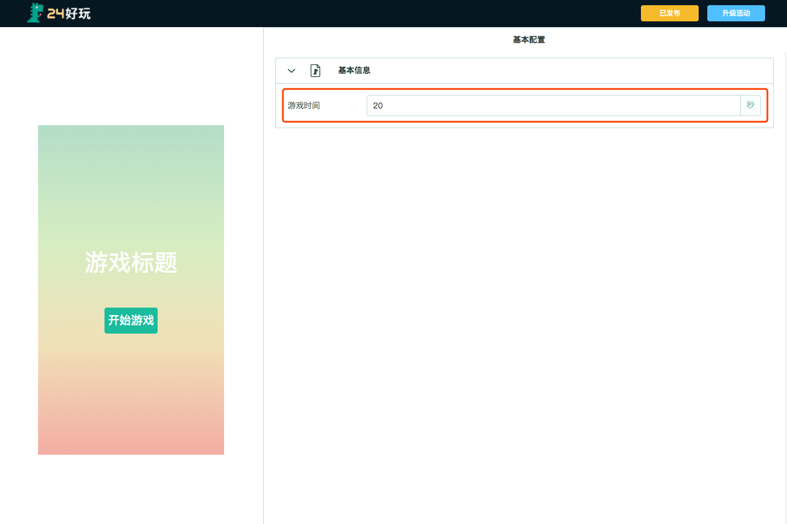
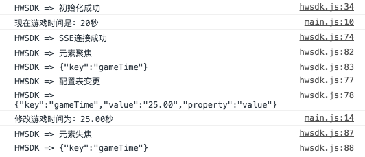

# 简单的调试示例

#### 例子

例如我们的模板希望开放游戏时间给用户去配置，那么我们需要工作台显示出一个数字的输入框，按一下步骤编写代码和配置表：

##### 第一步：编辑配置表

编辑`config.json`中的内容，类似于下列示例。配置表的具体说明，可参考配置表说明文档。

```
{
    "static": {
        "name": "小恐龙点点点"
    },
    "dist": {
        "gameTime": {
            "value": 20
        }
    },
    "workbench": {
        "pages": [
            {
                "modules": [
                    {
                        "id": "base",
                        "name": "基本信息",
                        "icon": "icon-game-page",
                        "elements": [
                            {
                                "id": "gameTime",
                                "name": "游戏时间",
                                "type": "number",
                                "min": 10,
                                "max": 30,
                                "placeholder": "请输入游戏时间，最小10，最大30",
                                "suffix": "秒",
                                "description": "游戏时间内尽可能得分",
                                "accuracy": 2
                            }
                        ]
                    }
                ],
                "name": "基本配置",
                "id": "base"
            }
        ]
    }
}
```

##### 第二步：编辑模板代码，获取对应的值

```javascript
var config; // 模板配置表
var gameTime = 20; // 游戏时间
hwsdk.init(true);
hwsdk.getConfig(function(_config) {
    config = _config;
    gameTime = config.gameTime.value;
    console.log("现在游戏时间是：" + gameTime + "秒");
    // 监听游戏时间的变化
    hwsdk.on('change', 'gameTime', function(data) {
        gameTime = data.value;
        console.log("修改游戏时间为：" + gameTime + "秒");
    });
});
```

##### 第三步：刷新页面

这时候你就能看到以下界面了：



同时修改了游戏时间以后可以在控制台看到以下输出：


